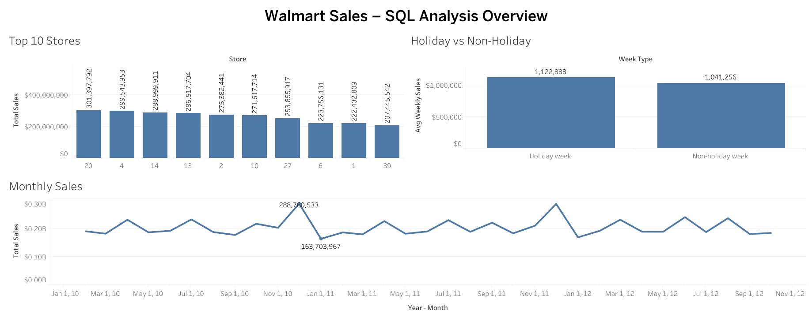

## Walmart Sales SQL Analytics (MySQL)

This project analyzes **Walmart weekly store sales** using **pure SQL on MySQL**, with a supporting Tableau dashboard and BA-style documentation.

It focuses on questions such as:

- Which stores drive the most revenue?
- How volatile are store sales week-to-week?
- How do **holiday weeks** compare to normal weeks?
- How do sales vary by **month** and **half-year (H1/H2)**?
- How do macro factors like **temperature** and **unemployment** relate to sales?

The goal is to showcase strong SQL querying, structured business analysis, and clear communication for Data / Business Analyst roles.

---

## 🎯 Business Question

A retail analytics team at Walmart wants to understand:

- Which stores are top performers by **total sales**?
- Which stores have the **most unstable** weekly sales patterns (higher volatility / risk)?
- Do **holiday weeks** truly outperform non-holiday weeks overall?
- How do **monthly and half-year trends** look across the 2010–2012 period?
- Are sales patterns sensitive to **temperature** or **unemployment** bands?

These insights will help guide marketing focus, inventory planning, and store-level performance reviews.

---

## 📂 Project Structure

```
walmart-sales-sql-analytics/
├── data/
│   ├── raw/
│   │   └── Walmart_Store_sales.csv               # Original Kaggle Walmart weekly store sales dataset
│   └── processed/                                # (Reserved for any future exports)
├── docs/
│   └── walmart_sql_case_study.md                 # Narrative case study & recommendations
├── sql/
│   ├── 01_exploration.sql                        # Data checks, profiling, basic summaries
│   └── 02_business_questions.sql                 # Core business analysis queries
├── tableau/
│   └── walmart_sales_sql_analysis_overview.twb   # Tableau workbook for the dashboard
└── README.md                                     # Project overview (this file)

```
---

## 📊 Data

* Source
  - Public Kaggle dataset: Walmart Store Sales
  - Loaded as a CSV: data/raw/Walmart_Store_sales.csv
* Unit of analysis
  - 1 row = weekly sales for a single Walmart store.
* Database objects
  - Database: walmart_sql_db
  - Base table: walmart_store_sales
  - Analysis view: walmart_store_sales_v
    (converts the original text date to a proper DATE)
* Key columns
  - Store – store ID
  - Date – week of sales (in the view)
  - Weekly_Sales – total sales in that week for that store
  - Holiday_Flag – 1 = holiday week, 0 = non-holiday
  - Temperature – local temperature
  - Fuel_Price – local fuel price
  - CPI – consumer price index
  - Unemployment – local unemployment rate

---

## 🧮 SQL Analysis Design

All analysis is written in plain SQL and organized into two scripts:
```
sql/01_exploration.sql
```
Exploratory checks to understand and validate the data:
  - Total row count, number of distinct stores
  - Date range and weeks per store
  - Basic stats on Weekly_Sales (min, max, avg, stddev)
  - Distribution checks for Holiday_Flag, Temperature, Unemployment, etc.
```
sql/02_business_questions.sql
```
Answers the key business questions with:
  - Top 10 stores by total sales
    - Aggregation: SUM(Weekly_Sales) grouped by Store
  - Sales volatility by store
    - STDDEV_POP(Weekly_Sales) for each store
    - Coefficient of variation to compare relative volatility
  - Holiday vs non-holiday performance
    - Average weekly sales by Holiday_Flag
  - Monthly & half-year trends
    - YEAR(Date) + MONTH(Date) for monthly totals
    - Half-year flag (H1/H2) using a CASE expression
  - Macro factor bands
    - Temperature bands (e.g., cold / mild / hot)
    - Unemployment bands (low / medium / high)
    - Average sales by band to see simple relationships

---

## 🖼️ Dashboard Preview
A Tableau dashboard is built from the SQL outputs (top stores, monthly trend, and holiday vs non-holiday performance):



The dashboard includes:
  - Top 10 Stores – bar chart of highest total sales by store
  - Holiday vs Non-Holiday – comparison of average weekly sales
  - Monthly Sales Trend – line chart of sales over time (Year–Month)

---

## 🔢 Headline Patterns (Example)
From the current analysis:
  - A handful of top stores contribute a disproportionate share of sales.
  - Holiday weeks generally show higher average weekly sales than non-holiday weeks, but not all holidays outperform.
  - Monthly sales trend shows clear seasonal spikes and dips across the year.
  - Some stores exhibit high volatility, indicating potential forecasting and inventory challenges.
  - Temperature and unemployment bands show weak–moderate relationships with sales, suggesting external macro factors play a role but are not the sole drivers.
A fuller discussion is captured in:
  - docs/walmart_sql_case_study.md

---

## 🛠️ Tools & Skills Used
* MySQL + MySQL Workbench
  - Schema design, table creation
  - Data import via Table Data Import Wizard
  - Window functions, CTEs, and analytical aggregates
* SQL
  - Aggregations (SUM, AVG, STDDEV)
  - GROUP BY, HAVING
  - Window functions (LAG, ranking/running totals where needed)
  - CTEs (WITH), date functions, CASE logic
* Tableau Public
  - Visualizing top stores, trends, and holiday comparison
  - Creating a single-page analysis overview
* Business Analysis
  - Translating queries into clear business answers
  - Writing a case study with implications and next steps
* Git & GitHub
  - Version control for SQL scripts, docs, and workbook
  - Public repo for portfolio/recruiter review

---

## 🚀 How to Reproduce the Analysis

1️⃣ Create MySQL schema & table
  In MySQL Workbench:
```
Copy code
CREATE DATABASE walmart_sql_db;

USE walmart_sql_db;

CREATE TABLE walmart_store_sales (
  Store        INT,
  Date_str     VARCHAR(20),
  Weekly_Sales DECIMAL(12,2),
  Holiday_Flag TINYINT,
  Temperature  DECIMAL(6,2),
  Fuel_Price   DECIMAL(6,3),
  CPI          DECIMAL(8,3),
  Unemployment DECIMAL(5,2)
);
```
Note: Date_str is loaded as text from the CSV and later converted to DATE in the view.

2️⃣ Import the CSV
  - In MySQL Workbench, right-click walmart_store_sales → Table Data Import Wizard.
  - Select data/raw/Walmart_Store_sales.csv.
  - Map the CSV Date column → Date_str in the table.
  - Complete the wizard to load all rows.

3️⃣ Create the analysis view
```
CREATE OR REPLACE VIEW walmart_store_sales_v AS
SELECT
  Store,
  STR_TO_DATE(Date_str, '%d-%m-%Y') AS Date,
  Weekly_Sales,
  Holiday_Flag,
  Temperature,
  Fuel_Price,
  CPI,
  Unemployment
FROM walmart_store_sales;
```

4️⃣ Run the SQL scripts
  - Open sql/01_exploration.sql in MySQL Workbench and execute it to profile the data.
  - Then open sql/02_business_questions.sql and execute it to generate all analysis result sets.
You can optionally export the aggregated outputs (e.g., top 10 stores, monthly totals, holiday vs non-holiday) as CSVs for visualization.

5️⃣ Open the Tableau dashboard (optional but recommended)
  - Launch Tableau Public / Desktop.
  - Open: tableau/walmart_sales_sql_analysis_overview.twb.
  - If needed, point any data sources to your exported CSVs or a direct MySQL connection.

---

## ✍️ Author

Sai Siddesh Reddy Bynigeri

Business / Data Analyst – SQL, Tableau, Excel, Python
